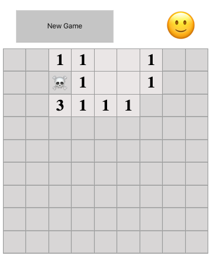

# React-игра "Сапер"



Игра-головоломка с 10 минами.

Целью игры является открытие всех ячеек, не содержащих мины.

Иногда игрок оказывается перед необходимостью открывать ячейки наугад.
Под первой открытой ячейкой может оказаться мина.
Цифра на поле показывает сколько мин скрыто в восьми ячейках вокруг данной цифры.
Что бы пометить ячейку, в которой находится мина, нужно нажать на её правой кнопкой мыши.

Открыв все «не заминированные» ячейки, игрок выигрывает.

### Используемые технологии

React, MobX

### Запуск проекта

```
npm i

npm start
```
